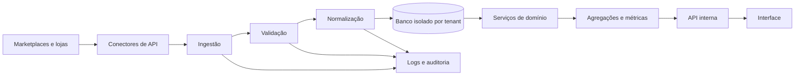

# Arquitetura

## Diagrama de alto nível

## Camadas a confirmar no código
| Camada | Caminho real | Responsabilidade | Status |
|---|---|---|---|
| Interface |  |  | não auditado |
| Rotas/API |  |  | não auditado |
| Serviços |  |  | não auditado |
| Domínio |  |  | não auditado |
| Persistência |  |  | não auditado |
| Integrações |  |  | não auditado |
| Validação |  |  | não auditado |
| Tipos |  |  | não auditado |

## Regras
- Componentes visuais não acessam diretamente APIs externas.
- Conectores externos não definem diretamente o modelo interno.
- Regras de negócio não ficam duplicadas entre páginas.
- Consultas devem carregar o escopo do tenant.
