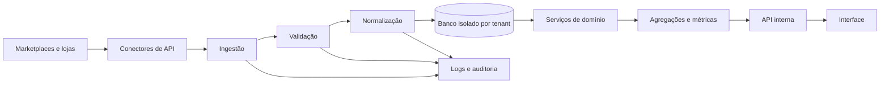

# Arquitetura

## Diagrama de alto nível

```mermaid
flowchart LR
    A[Marketplaces e lojas] --> B[Conectores de API]
    B --> C[Ingestão]
    C --> D[Validação]
    D --> E[Normalização]
    E --> F[(Banco isolado por tenant)]
    F --> G[Serviços de domínio]
    G --> H[Agregações e métricas]
    H --> I[API interna]
    I --> J[Interface]
    C --> K[Logs e auditoria]
    D --> K
    E --> K
```

## Camadas a confirmar no código
| Camada | Caminho real | Responsabilidade | Status |
|---|---|---|---|
| Interface |  |  | não auditado |
| Rotas/API |  |  | não auditado |
| Serviços |  |  | não auditado |
| Domínio |  |  | não auditado |
| Persistência |  |  | não auditado |
| Integrações |  |  | não auditado |
| Validação |  |  | não auditado |
| Tipos |  |  | não auditado |

## Regras
- Componentes visuais não acessam diretamente APIs externas.
- Conectores externos não definem diretamente o modelo interno.
- Regras de negócio não ficam duplicadas entre páginas.
- Consultas devem carregar o escopo do tenant.

## Registry universal de canais VTEX

- `provider` identifica o conector/source que entregou o dado; continua controlado.
- `sales_channel` identifica onde a venda ocorreu; é uma chave textual extensível registrada em `sales_channels`.
- `vtex_channel_mappings` resolve identidade externa por `company_id` + `connection_id`; affiliate IDs não têm significado global presumido.
- Canal novo é persistido como `external:vtex:*` e `unresolved`, sem criar provider direto.
- Elegibilidade global (`analytics_included`) e resolução do canal (`channel_resolution_status`) são decisões independentes.
- `order_source_refs` preserva origem e identidade suficientes para reclassificação/deduplicação futura.
