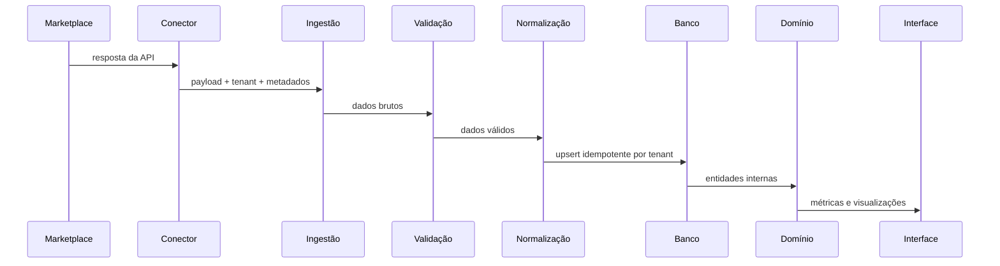

# Fluxos de dados

## Fluxo padrão

## Mapa a preencher após auditoria
| Dado | Origem | Entrada | Validação | Normalização | Persistência | Leitura | Tela |
|---|---|---|---|---|---|---|---|
| Pedidos |  |  |  |  |  |  |  |
| Produtos |  |  |  |  |  |  |  |
| Estoque |  |  |  |  |  |  |  |
| Custos |  |  |  |  |  |  |  |
| Canais |  |  |  |  |  |  |  |

## Regras de integridade
- Não confiar em campos externos sem validação.
- Não sobrescrever dados internos com valores ausentes.
- Não duplicar pedidos ao reprocessar.
- Não cruzar tenants.
- Não transformar falha parcial em sucesso silencioso.
