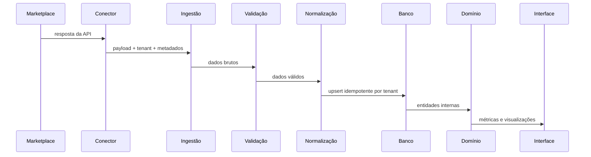
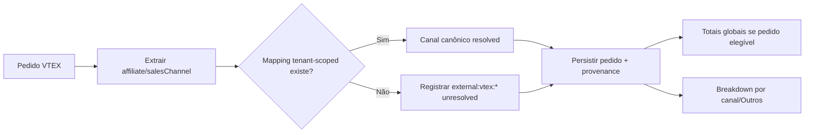

# Fluxos de dados

## Fluxo padrão

```mermaid
sequenceDiagram
    participant EXT as Marketplace
    participant CON as Conector
    participant ING as Ingestão
    participant VAL as Validação
    participant NOR as Normalização
    participant DB as Banco
    participant DOM as Domínio
    participant UI as Interface

    EXT->>CON: resposta da API
    CON->>ING: payload + tenant + metadados
    ING->>VAL: dados brutos
    VAL->>NOR: dados válidos
    NOR->>DB: upsert idempotente por tenant
    DB->>DOM: entidades internas
    DOM->>UI: métricas e visualizações
```

## Mapa a preencher após auditoria
| Dado | Origem | Entrada | Validação | Normalização | Persistência | Leitura | Tela |
|---|---|---|---|---|---|---|---|
| Pedidos |  |  |  |  |  |  |  |
| Produtos |  |  |  |  |  |  |  |
| Estoque |  |  |  |  |  |  |  |
| Custos |  |  |  |  |  |  |  |
| Canais |  |  |  |  |  |  |  |

## Regras de integridade
- Não confiar em campos externos sem validação.
- Não sobrescrever dados internos com valores ausentes.
- Não duplicar pedidos ao reprocessar.
- Não cruzar tenants.
- Não transformar falha parcial em sucesso silencioso.

## Descoberta de canal pela VTEX

```mermaid
flowchart LR
    A[Pedido VTEX] --> B[Extrair affiliate/salesChannel]
    B --> C{Mapping tenant-scoped existe?}
    C -->|Sim| D[Canal canônico resolved]
    C -->|Não| E[Registrar external:vtex:* unresolved]
    D --> F[Persistir pedido + provenance]
    E --> F
    F --> G[Totais globais se pedido elegível]
    F --> H[Breakdown por canal/Outros]
```

Affiliate novo gera warning/evento sanitizado, mas não falha o sync. Um mapping criado depois reprocessa a mesma source reference e atualiza a identidade canônica sem nova venda analítica.
